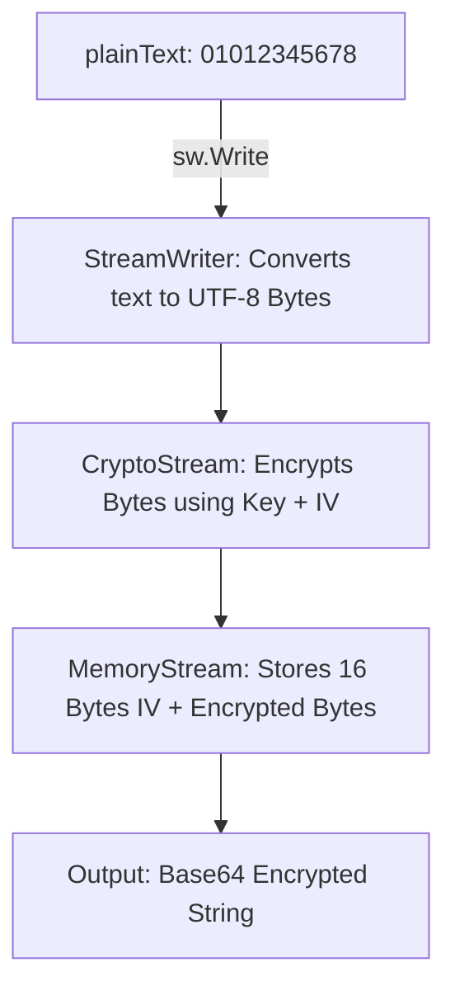
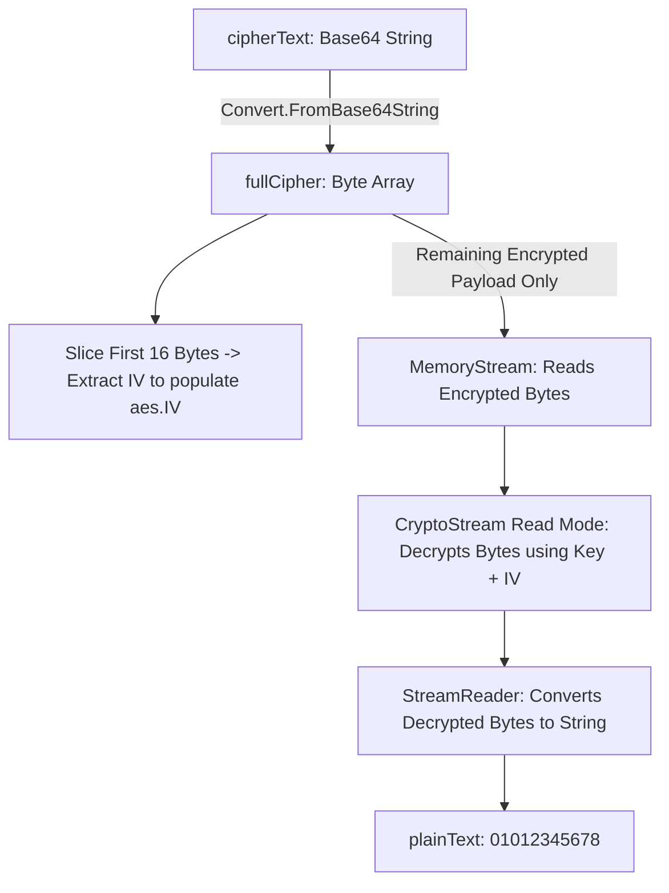

# AES Encryption & Decryption Flowcharts

## 1. Encryption Pipeline

### Visual Diagram


### Text Flowchart
<!-- prettier-ignore -->
```text
[plainText: "01012345678"]
       │
       ▼ (sw.Write)
[StreamWriter: Converts text to UTF-8 Bytes]
       │
       ▼
[CryptoStream: Encrypts Bytes using Key + IV]
       │
       ▼
[MemoryStream: Stores (16 Bytes IV) + (Encrypted Bytes)]
       │
       ▼
[Output: Base64 Encrypted String]
```

---

## 2. Decryption Pipeline

### Visual Diagram


### Text Flowchart
<!-- prettier-ignore -->
```text
[cipherText: Base64 String]
       │
       ▼ (Convert.FromBase64String)
[fullCipher: Byte Array]
       │
       ├──────────────► [Slice First 16 Bytes] ──► (Extract IV to populate aes.IV)
       │
       ▼ [Remaining Encrypted Payload Only]
[MemoryStream: Reads Encrypted Bytes]
       │
       ▼
[CryptoStream (Read Mode): Decrypts Bytes using Key + IV]
       │
       ▼
[StreamReader: Converts Decrypted Bytes to String]
       │
       ▼
[plainText: "01012345678"]
```
